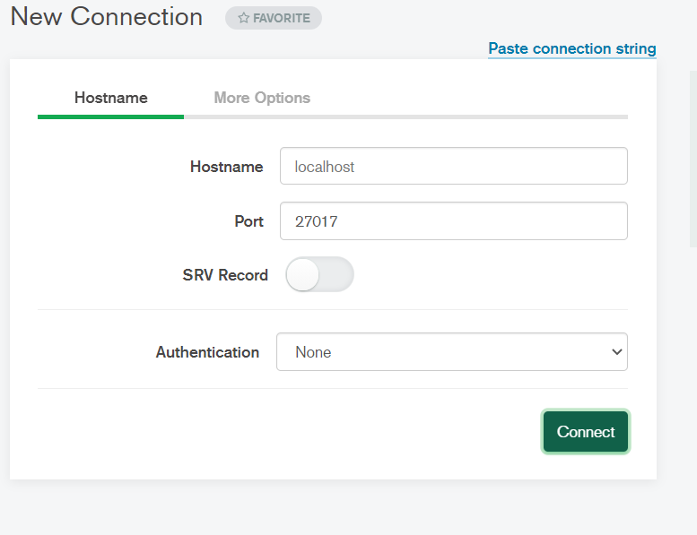

# REST API Using NodeJS + ExpressJS + MongoDB

### Run your  server 
```javascript
node src/app.js
```
### Connect to your  Mongo compass


### Copy the URL and paste it on the Postman to run the API
